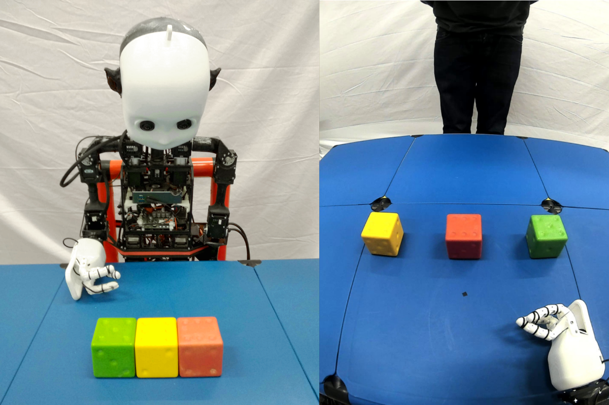
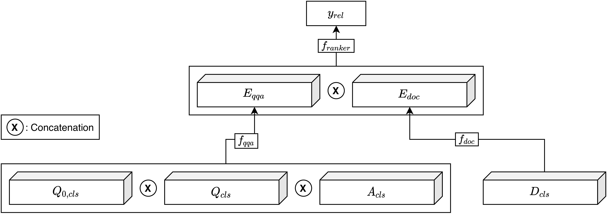
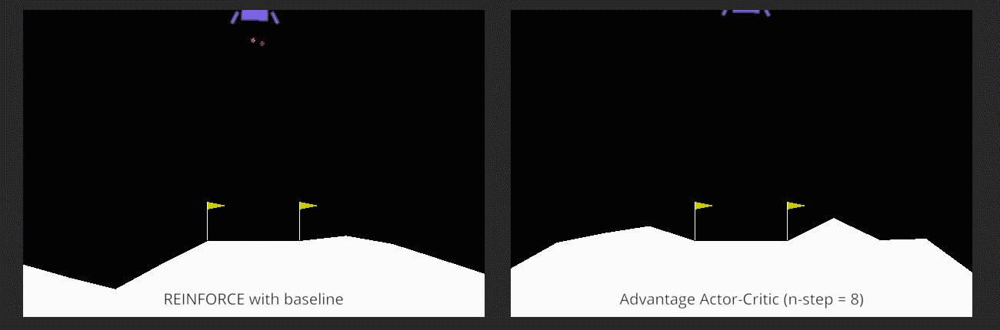

## About Me

Hi there! I am David and I enjoy working on computer vision and machine learning research related things. In January
2021 I finished my two-year research Master's in Artificial Intelligence at the University of Amsterdam. I spent my
thesis with the Autonomous Driving Team at TomTom. The internship resulted in the publication _Prior to Segment:
Foreground Cues for Weakly Annotated Classes in Partially Supervised Instance Segmentation_ which was accepted at __ICCV
2021__.

I spent my undergraduate in the field of Human Computer Interaction where my focus lied on human-robot interaction,
biopsychology and creating intuitive interfaces in VR. I also had the chance to dive deep into software engineering
principles, algorithms & data structures and theoretical informatics.

Lately, I've been interested in 3D computer vision, computer graphics, reinforcement learning and how to design
efficient models that run in real time on edge devices. These interests include applications such as autonomous driving,
computer vision for video calls and AR for mobile devices.

If you want to talk to me, feel free to contact me via email or Twitter.

[Twitter: @dbtmpl](https://twitter.com/dbtmpl)
__⋅__ [Email: david(dot)biertimpel(at)protonmail(dot)com](mailto:david.biertimpel@protonmail.com)

You can find my CV [here](assets/cv.pdf).

## Research

**2021:**  

**Prior to Segment: Foreground Cues for Weakly Annotated Classes in Partially Supervised Instance Segmentation**  
Accepted at ICCV 2021  
*†[David Biertimpel](https://scholar.google.com/citations?user=AIu7ihgAAAAJ&hl=en),
†[Sindi Shkodrani](https://scholar.google.nl/citations?user=fFVkKNgAAAAJ&hl=en)
, *[Anil S. Baslamisli](https://scholar.google.nl/citations?user=mc4l2J4AAAAJ&hl=en) and
†[Nóra Baka](https://scholar.google.com/citations?user=ahfzQHEAAAAJ&hl=en)  
*University of Amsterdam, †TomTom 
[[Pre-Print](https://arxiv.org/abs/2011.11787)][[Code](https://github.com/dbtmpl/OPMask)]

---

**2020:**  

**Solving visual object ambiguities when pointing: an unsupervised learning approach** 
Published at Neural Computing and Applications 2020  
*‡[Doreen Jirak](https://scholar.google.com/citations?user=-HgMDDYAAAAJ&hl), *
†[David Biertimpel](https://scholar.google.com/citations?user=AIu7ihgAAAAJ&hl=en)
, *[Matthias Kerzel](https://www.inf.uni-hamburg.de/en/inst/ab/wtm/people/kerzel.html)
and *[Stefan Wermter](https://www.inf.uni-hamburg.de/en/inst/ab/wtm/people/wermter.html)  
*University of Hamburg, ‡Istituto Italiano di Tecnologia, †University of Amsterdam 
[[Paper](https://link.springer.com/article/10.1007/s00521-020-05109-w)][[Pre-Print](https://arxiv.org/abs/1912.06449)][[Code](https://github.com/dbtmpl/Solving-Visual-Object-Ambiguities-when-Pointing)]

---

## Projects

**Towards Neural Ranking for Mixed-Initiative Conversational Search**  
*[Hinrik Snær Guðmundsson](https://www.linkedin.com/in/hinrik-sn%C3%A6r-gu%C3%B0mundsson-105b09148/), *[David Biertimpel](https://scholar.google.com/citations?user=AIu7ihgAAAAJ&hl=en)  
*University of Amsterdam (2020)  
[[Article](assets/ir/ir.pdf)][[Code](https://github.com/dbtmpl/Information-Retrieval-2)]

---

**Exploring Variance in N-Step Actor-Critic Methods**  
*[David Biertimpel](https://scholar.google.com/citations?user=AIu7ihgAAAAJ&hl=en)
, *[Claartje Barkhof](https://github.com/ClaartjeBarkhof), *[Vicky Foing](https://github.com/victoriafoing)
& *[Alex Lindt](https://github.com/alex-lindt)  
*University of Amsterdam (2019)  
[[Article](rl_section.md)][[Code](https://github.com/alex-lindt/variance_n_step_actor_critic)]

---

**HandsOnVR**  
*[Lukas Bittner](), *[David Biertimpel](https://scholar.google.com/citations?user=AIu7ihgAAAAJ&hl=en), *[Kevin Rodrigues Nobre](), *[Jannis Volz]() & *[Marian Wiskow]()  
*University of Hamburg (2018)  
[[Article](https://www.inf.uni-hamburg.de/en/inst/ab/hci/projects/handsonvr.html)][[Video](https://www.youtube.com/watch?v=0a2r9THnyvg)]

---