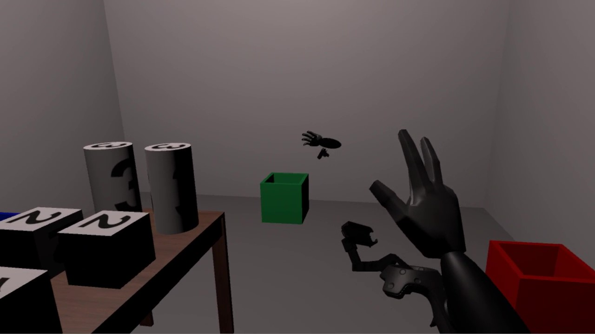

## About Me

Lorem ipsum dolor sit amet, consectetur adipiscing elit, sed do eiusmod tempor incididunt ut labore et dolore magna
aliqua. Ut enim ad minim veniam, quis nostrud exercitation ullamco laboris nisi ut aliquip ex ea commodo consequat. Duis
aute irure dolor in reprehenderit in voluptate velit esse cillum dolore eu fugiat nulla pariatur. Excepteur sint
occaecat cupidatat non proident, sunt in culpa qui officia deserunt mollit anim id est laborum.

You can find my CV [here](https://github.com/dbtmpl/Curriculum-Vitae).

## Research

**2021:**  

**Prior to Segment: Foreground Cues for Weakly Annotated Classes in Partially Supervised Instance Segmentation**  
Accepted at ICCV 2021  
*†[David Biertimpel](https://scholar.google.com/citations?user=AIu7ihgAAAAJ&hl=en), †[Sindi Shkodrani](https://scholar.google.nl/citations?user=fFVkKNgAAAAJ&hl=en), *[Anil S. Baslamisli](https://scholar.google.nl/citations?user=mc4l2J4AAAAJ&hl=en) and †[Nóra Baka](https://scholar.google.com/citations?user=ahfzQHEAAAAJ&hl=en)  
*University of Amsterdam, †TomTom 
[[Pre-Print](https://arxiv.org/abs/2011.11787)][[Code](https://github.com/dbtmpl/OPMask)]

---

**2020:**  

**Solving visual object ambiguities when pointing: an unsupervised learning approach** 
Published at Neural Computing and Applications 2020  
*‡[Doreen Jirak](https://scholar.google.com/citations?user=-HgMDDYAAAAJ&hl), *†[David Biertimpel](https://scholar.google.com/citations?user=AIu7ihgAAAAJ&hl=en), *[Matthias Kerzel](https://www.inf.uni-hamburg.de/en/inst/ab/wtm/people/kerzel.html) and *[Stefan Wermter](https://www.inf.uni-hamburg.de/en/inst/ab/wtm/people/wermter.html)  
*University of Hamburg, ‡Istituto Italiano di Tecnologia, †University of Amsterdam 
[[Paper](https://link.springer.com/article/10.1007/s00521-020-05109-w)][[Pre-Print](https://arxiv.org/abs/1912.06449)][[Code](https://github.com/dbtmpl/Solving-Visual-Object-Ambiguities-when-Pointing)]

---

## Projects

**Exploring Variance in N-Step Actor-Critic Methods**  
*[David Biertimpel](https://scholar.google.com/citations?user=AIu7ihgAAAAJ&hl=en), *[Claartje Barkhof](https://github.com/ClaartjeBarkhof), *[Vicky Foing](https://github.com/victoriafoing) & *[Alex Lindt](https://github.com/alex-lindt)  
*University of Amsterdam (2019)  
[[Article](rl_section.md)][[Code](https://github.com/dbtmpl/OPMask)]

**HandsOnVR**  
*[David Biertimpel](https://scholar.google.com/citations?user=AIu7ihgAAAAJ&hl=en), *[Lukas Bittner](), *[Kevin Rodrigues Nobre](), *[Jannis Volz]() & *[Marian Wiskow]()  
*University of Hamburg (2018)  
[[Article](https://www.inf.uni-hamburg.de/en/inst/ab/hci/projects/handsonvr.html)][[Video](https://www.youtube.com/watch?v=0a2r9THnyvg)]

---

[1.2]: http://i.imgur.com/wWzX9uB.png (Twitter)
[![alt text][1.2] @dbtmpl](https://twitter.com/dbtmpl)